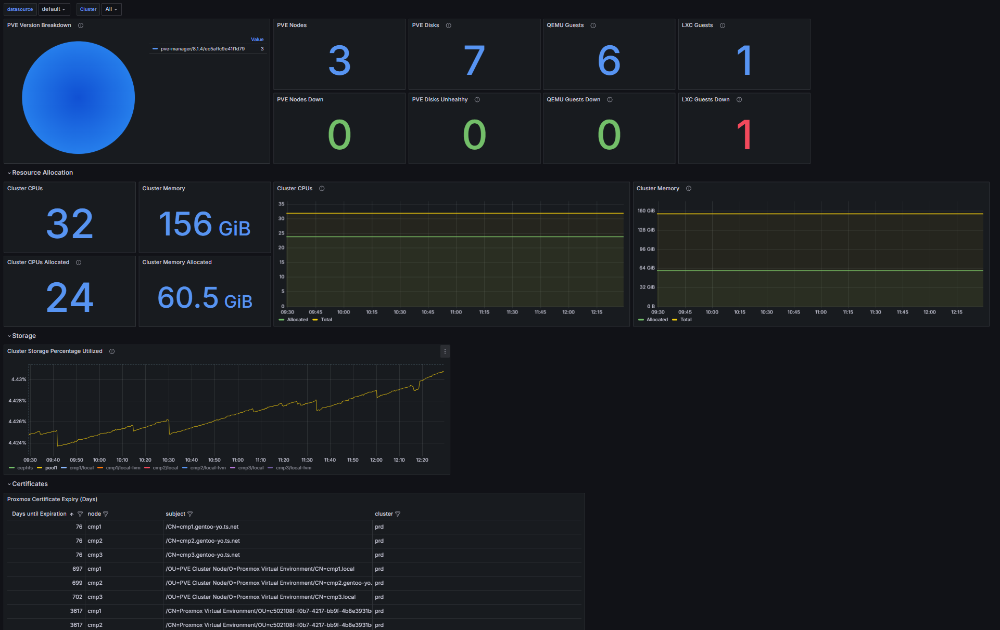

# Proxmox Exporter

A Prometheus exporter for Proxmox clusters.

- [About](#about)
- [Usage](#usage)
  - [Docker](#docker)
  - [Helm](#helm)
  - [Shell](#shell)
- [Grafana](#grafana)
- [Alerting](#alerting)
- [License](#license)

## About

This exporter accepts one or multiple Proxmox manager API endpoints to disperse requests between different nodes in your Proxmox cluster at random. In theory this allows you to spread out your API server's compute load across the cluster.

It also does API response caching. We cache the responses for up to 29 seconds, which should produce fresh metrics if scraped in 30 second intervals, or respond with cache at least half of the time if scraped in 15 second intervals. If you run highly available Prometheus instances that each scrape this exporter, it should only need to make the same set of requests to Proxmox's API one time per 30 second scrape interval.

When cache is _not_ used, this exporter makes `1 + (6 * <number of PVE nodes>)` API requests against your cluster to display its metrics. One to list nodes in the PVE cluster, and 6 per-node to reach all of the node specific endpoints this exporter gets its data from.  The number of API endpoints it uses may increase as additional types of metrics are added.

The number of nodes in your cluster shouldn't significantly slow down this exporter's response time, because each set of requests for a node are made concurrently.

When the Proxmox API returns an error response, if multiple API endpoints were given to this exporter's configuration, the request will be retried against one of them randomly. This provides some slack for Proxmox clusters that are in the middle of some temporary maintenance downtime on a node.

We avoid exporting metrics which are redundant to metrics that may be collected by [node_exporter.](https://github.com/prometheus/node_exporter) Ideally, node_exporter should be ran in tandem with this, on your Proxmox nodes as well as in all of your guests.

If you have a feature request, suggestion, or want to see another metric, open up an Issue or a Pull Request and we can discuss it!

## Usage

You will need to know some Proxmox API endpoints (`--proxmox-endpoints`), and have a Proxmox API token that's valid to each of those endpoints (should be true in a cluster.) Your Proxmox API token needs at least the PVEAuditor role. When you create an API token (`--proxmox-token`), it comes with a user identifying string (`--proxmox-token-id`) which is also needed. Lastly, if your API server's TLS cannot be verified, you will need to set `--proxmox-api-insecure=true`.

### Docker

You can run proxmox-exporter in docker. You will need to set at minimum the `PROXMOX_EXPORTER_PROXMOX_ENDPOINTS`, `PROXMOX_EXPORTER_PROXMOX_TOKEN`, and `PROXMOX_EXPORTER_PROXMOX_TOKEN_ID` fields. You can also set `PROXMOX_EXPORTER_PROXMOX_API_INSECURE` to `true` to allow insecure connections to the API server(s). You can set `PROXMOX_EXPORTER_LOG_LEVEL` to `debug` to get more verbose logging.

```bash
docker run --name proxmox-exporter \
-p 8080:8080 \
-e PROXMOX_EXPORTER_LOG_LEVEL='info' \
-e PROXMOX_EXPORTER_PROXMOX_API_INSECURE='false' \
-e PROXMOX_EXPORTER_PROXMOX_ENDPOINTS='https://x:8006/,https://y:8006/,https://z:8006/' \
-e PROXMOX_EXPORTER_PROXMOX_TOKEN='redacted-token' \
-e PROXMOX_EXPORTER_PROXMOX_TOKEN_ID='redacted-token-id' \
-e PROXMOX_EXPORTER_SERVER_PORT='8080' \
ghcr.io/starttoaster/proxmox-exporter:latest
```

### Helm

This repository publishes a helm chart. It's located this repo's `chart` directory. In its values file, you'll need to edit the fields under `configuration`, and optionally the `serviceMonitor` fields.

Create your own file named `values.yaml` and edit the following:

```yaml
config:
  # required: Set to your actual API server URL(s). Can be one, or multiple separated by commas
  # Ex: https://x:8006/,https://y:8006/,https://z:8006/
  endpoints: ''

  # required: A Proxmox API token and token-ID. Needs to have at least the PVEAuditor role
  token: ''
  tokenID: ''

  # optional: Set to 'true' if the API server's TLS can not be verified
  api_insecure: 'false'

  # optional: Set to 'debug' for more logs
  log_level: 'info'

  # optional: If you change this, change the service.port value too
  port: '8080'

# optional: creates a ServiceMonitor that targets this exporter's service -- for use with the kube-prometheus operator
serviceMonitor:
  enabled: false
  ## The label to use to retrieve the job name from.
  ## jobLabel: "app.kubernetes.io/name"
  additionalLabels: {}
  annotations: {}
  targetLabels: []
  relabelings: []
  metricRelabelings: []

# optional: creates a PrometheusRule with some basic alerts for proxmox clusters -- for use with the kube-prometheus operator
prometheusRule:
  enabled: false
```

Install the chart:

```bash
helm upgrade --install --create-namespace \
--repo "https://starttoaster.github.io/proxmox-exporter" 
-n proxmox-exporter \
--values ./values.yaml \
proxmox-exporter \
proxmox-exporter
```

### Shell

With Go installed, you can build an executable and run it anywhere. From inside this repo's root directory:

```bash
go build
./proxmox-exporter [...configuration]
```

You can pass your configuration with the following CLI flags.

```bash
Usage:
  proxmox-exporter [flags]

Flags:
  -h, --help                       help for proxmox-exporter
      --log-level string           The log-level for the application, can be one of info, warn, error, debug. (default "info")
      --proxmox-api-insecure       Whether or not this client should accept insecure connections to Proxmox (default: false)
      --proxmox-endpoints string   The Proxmox API endpoint, you can pass in multiple endpoints separated by commas (ex: https://localhost:8006/)
      --proxmox-token string       Proxmox API token
      --proxmox-token-id string    Proxmox API token ID
      --server-port uint16         The port the metrics server binds to. (default 8080)
```

Or you can set the corresponding environment variables.

```bash
PROXMOX_EXPORTER_LOG_LEVEL="info"
PROXMOX_EXPORTER_PROXMOX_API_INSECURE=false
PROXMOX_EXPORTER_PROXMOX_ENDPOINTS="https://x:8006/,https://y:8006/,https://z:8006/"
PROXMOX_EXPORTER_PROXMOX_TOKEN="redacted-token"
PROXMOX_EXPORTER_PROXMOX_TOKEN_ID="redacted-token-id"
PROXMOX_EXPORTER_SERVER_PORT=8080
```

## Grafana

In the content folder of this repository there's an example Grafana dashboard using this exporter. It's exported to JSON so you may import it into your grafana server. 

Simply copy the JSON, and in your grafana instance, in the Dashboards tab, select `New > Import` and then paste the JSON into the `Import via dashboard JSON model` textbox and hit save.



A Grafana dashboard that implements this exporter with metrics from node_exporter is also in the works. Contributions are welcome for this as well.

## Alerting

The Helm chart in this repository comes with some Prometheus rules for PVE servers. More alerts are being added to it over time. Find that in the `chart/proxmox-exporter/templates` directory.

## Metrics

A list of metrics this exports is below. Newlines between metrics were added for readability.

```
# HELP proxmox_cluster_cpus_allocated Total number of vCPU (cores/threads) allocated to guests for a cluster.
# TYPE proxmox_cluster_cpus_allocated gauge
proxmox_cluster_cpus_allocated 24

# HELP proxmox_cluster_cpus_total Total number of vCPU (cores/threads) for a cluster.
# TYPE proxmox_cluster_cpus_total gauge
proxmox_cluster_cpus_total 32

# HELP proxmox_cluster_memory_allocated_bytes Total amount of memory allocated in bytes to guests for a cluster.
# TYPE proxmox_cluster_memory_allocated_bytes gauge
proxmox_cluster_memory_allocated_bytes 6.4961380352e+10

# HELP proxmox_cluster_memory_total_bytes Total amount of memory in bytes for a cluster.
# TYPE proxmox_cluster_memory_total_bytes gauge
proxmox_cluster_memory_total_bytes 1.67585333248e+11

# HELP proxmox_guest_up Shows whether VMs and LXCs in a proxmox cluster are up. (0=down,1=up)
# TYPE proxmox_guest_up gauge
proxmox_guest_up{host="proxmox1",name="CT101",type="lxc",vmid="101"} 0
proxmox_guest_up{host="proxmox1",name="controller1",type="qemu",vmid="108"} 1
proxmox_guest_up{host="proxmox1",name="worker1",type="qemu",vmid="100"} 1
proxmox_guest_up{host="proxmox2",name="controller2",type="qemu",vmid="107"} 1
proxmox_guest_up{host="proxmox2",name="worker2",type="qemu",vmid="104"} 1
proxmox_guest_up{host="proxmox3",name="controller3",type="qemu",vmid="106"} 1
proxmox_guest_up{host="proxmox3",name="worker3",type="qemu",vmid="105"} 1

# HELP proxmox_node_cpus_allocated Total number of vCPU (cores/threads) allocated to guests for a node.
# TYPE proxmox_node_cpus_allocated gauge
proxmox_node_cpus_allocated{node="proxmox1"} 12
proxmox_node_cpus_allocated{node="proxmox2"} 6
proxmox_node_cpus_allocated{node="proxmox3"} 6

# HELP proxmox_node_cpus_total Total number of vCPU (cores/threads) for a node.
# TYPE proxmox_node_cpus_total gauge
proxmox_node_cpus_total{node="proxmox1"} 16
proxmox_node_cpus_total{node="proxmox2"} 8
proxmox_node_cpus_total{node="proxmox3"} 8

# HELP proxmox_node_days_until_cert_expiration Number of days until a certificate in PVE expires. Can report 0 days on metric collection errors, check exporter logs.
# TYPE proxmox_node_days_until_cert_expiration gauge
proxmox_node_days_until_cert_expiration{node="proxmox1",subject="/CN=Proxmox Virtual Environment/OU=c502108f-f0b7-4217-bb9f-4b8e3931be3c/O=PVE Cluster Manager CA"} 3625
proxmox_node_days_until_cert_expiration{node="proxmox1",subject="/OU=PVE Cluster Node/O=Proxmox Virtual Environment/CN=proxmox1.local"} 705
proxmox_node_days_until_cert_expiration{node="proxmox2",subject="/CN=Proxmox Virtual Environment/OU=c502108f-f0b7-4217-bb9f-4b8e3931be3c/O=PVE Cluster Manager CA"} 3625
proxmox_node_days_until_cert_expiration{node="proxmox2",subject="/OU=PVE Cluster Node/O=Proxmox Virtual Environment/CN=proxmox2.local"} 708
proxmox_node_days_until_cert_expiration{node="proxmox3",subject="/CN=Proxmox Virtual Environment/OU=c502108f-f0b7-4217-bb9f-4b8e3931be3c/O=PVE Cluster Manager CA"} 3625
proxmox_node_days_until_cert_expiration{node="proxmox3",subject="/OU=PVE Cluster Node/O=Proxmox Virtual Environment/CN=proxmox3.local"} 710

# HELP proxmox_node_disk_smart_status Disk SMART health status. (0=FAIL/Unknown,1=PASSED)
# TYPE proxmox_node_disk_smart_status gauge
proxmox_node_disk_smart_status{devpath="/dev/nvme0n1",node="proxmox1"} 1
proxmox_node_disk_smart_status{devpath="/dev/nvme0n1",node="proxmox2"} 1
proxmox_node_disk_smart_status{devpath="/dev/nvme0n1",node="proxmox3"} 1
proxmox_node_disk_smart_status{devpath="/dev/sda",node="proxmox1"} 1
proxmox_node_disk_smart_status{devpath="/dev/sda",node="proxmox2"} 1
proxmox_node_disk_smart_status{devpath="/dev/sda",node="proxmox3"} 1
proxmox_node_disk_smart_status{devpath="/dev/sdb",node="proxmox1"} 1

# HELP proxmox_node_memory_allocated_bytes Total amount of memory allocated in bytes to guests for a node.
# TYPE proxmox_node_memory_allocated_bytes gauge
proxmox_node_memory_allocated_bytes{node="proxmox1"} 3.9191576576e+10
proxmox_node_memory_allocated_bytes{node="proxmox2"} 1.2884901888e+10
proxmox_node_memory_allocated_bytes{node="proxmox3"} 1.2884901888e+10

# HELP proxmox_node_memory_total_bytes Total amount of memory in bytes for a nodes.
# TYPE proxmox_node_memory_total_bytes gauge
proxmox_node_memory_total_bytes{node="proxmox1"} 1.34850502656e+11
proxmox_node_memory_total_bytes{node="proxmox2"} 1.6367079424e+10
proxmox_node_memory_total_bytes{node="proxmox3"} 1.6367751168e+10

# HELP proxmox_node_storage_total_bytes Total amount of storage available in a volume on a node by storage type.
# TYPE proxmox_node_storage_total_bytes gauge
proxmox_node_storage_total_bytes{node="proxmox1",storage="cephfs",type="cephfs"} 2.338563555328e+12
proxmox_node_storage_total_bytes{node="proxmox1",storage="local",type="dir"} 1.0086172672e+11
proxmox_node_storage_total_bytes{node="proxmox1",storage="local-lvm",type="lvmthin"} 1.884119105536e+12
proxmox_node_storage_total_bytes{node="proxmox1",storage="pool1",type="rbd"} 2.40695626515e+12
proxmox_node_storage_total_bytes{node="proxmox2",storage="cephfs",type="cephfs"} 2.338563555328e+12
proxmox_node_storage_total_bytes{node="proxmox2",storage="local",type="dir"} 1.0086172672e+11
proxmox_node_storage_total_bytes{node="proxmox2",storage="local-lvm",type="lvmthin"} 1.836111101952e+12
proxmox_node_storage_total_bytes{node="proxmox2",storage="pool1",type="rbd"} 2.40695626515e+12
proxmox_node_storage_total_bytes{node="proxmox3",storage="cephfs",type="cephfs"} 2.338563555328e+12
proxmox_node_storage_total_bytes{node="proxmox3",storage="local",type="dir"} 1.0086172672e+11
proxmox_node_storage_total_bytes{node="proxmox3",storage="local-lvm",type="lvmthin"} 3.74538764288e+11
proxmox_node_storage_total_bytes{node="proxmox3",storage="pool1",type="rbd"} 2.40695626515e+12

# HELP proxmox_node_storage_used_bytes Total amount of storage used in a volume on a node by storage type.
# TYPE proxmox_node_storage_used_bytes gauge
proxmox_node_storage_used_bytes{node="proxmox1",storage="cephfs",type="cephfs"} 0
proxmox_node_storage_used_bytes{node="proxmox1",storage="local",type="dir"} 5.601427456e+09
proxmox_node_storage_used_bytes{node="proxmox1",storage="local-lvm",type="lvmthin"} 1.88977146285e+11
proxmox_node_storage_used_bytes{node="proxmox1",storage="pool1",type="rbd"} 6.838930195e+10
proxmox_node_storage_used_bytes{node="proxmox2",storage="cephfs",type="cephfs"} 0
proxmox_node_storage_used_bytes{node="proxmox2",storage="local",type="dir"} 5.399289856e+09
proxmox_node_storage_used_bytes{node="proxmox2",storage="local-lvm",type="lvmthin"} 2.3869444325e+10
proxmox_node_storage_used_bytes{node="proxmox2",storage="pool1",type="rbd"} 6.838930195e+10
proxmox_node_storage_used_bytes{node="proxmox3",storage="cephfs",type="cephfs"} 0
proxmox_node_storage_used_bytes{node="proxmox3",storage="local",type="dir"} 5.412220928e+09
proxmox_node_storage_used_bytes{node="proxmox3",storage="local-lvm",type="lvmthin"} 1.6367343999e+10
proxmox_node_storage_used_bytes{node="proxmox3",storage="pool1",type="rbd"} 6.838930195e+10

# HELP proxmox_node_up Shows whether host nodes in a proxmox cluster are up. (0=down,1=up)
# TYPE proxmox_node_up gauge
proxmox_node_up{node="proxmox1",type="node"} 1
proxmox_node_up{node="proxmox2",type="node"} 1
proxmox_node_up{node="proxmox3",type="node"} 1

# HELP proxmox_node_version Shows PVE manager node version information
# TYPE proxmox_node_version gauge
proxmox_node_version{node="proxmox1",version="pve-manager/8.1.4/ec5affc9e41f1d79"} 1
proxmox_node_version{node="proxmox2",version="pve-manager/8.1.4/ec5affc9e41f1d79"} 1
proxmox_node_version{node="proxmox3",version="pve-manager/8.1.4/ec5affc9e41f1d79"} 1
```

## License

MIT License

Copyright (c) 2024 Brandon Butler

Permission is hereby granted, free of charge, to any person obtaining a copy
of this software and associated documentation files (the "Software"), to deal
in the Software without restriction, including without limitation the rights
to use, copy, modify, merge, publish, distribute, sublicense, and/or sell
copies of the Software, and to permit persons to whom the Software is
furnished to do so, subject to the following conditions:

The above copyright notice and this permission notice shall be included in all
copies or substantial portions of the Software.

THE SOFTWARE IS PROVIDED "AS IS", WITHOUT WARRANTY OF ANY KIND, EXPRESS OR
IMPLIED, INCLUDING BUT NOT LIMITED TO THE WARRANTIES OF MERCHANTABILITY,
FITNESS FOR A PARTICULAR PURPOSE AND NONINFRINGEMENT. IN NO EVENT SHALL THE
AUTHORS OR COPYRIGHT HOLDERS BE LIABLE FOR ANY CLAIM, DAMAGES OR OTHER
LIABILITY, WHETHER IN AN ACTION OF CONTRACT, TORT OR OTHERWISE, ARISING FROM,
OUT OF OR IN CONNECTION WITH THE SOFTWARE OR THE USE OR OTHER DEALINGS IN THE
SOFTWARE.
